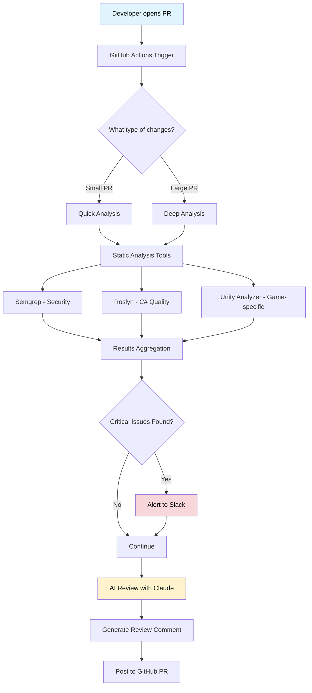
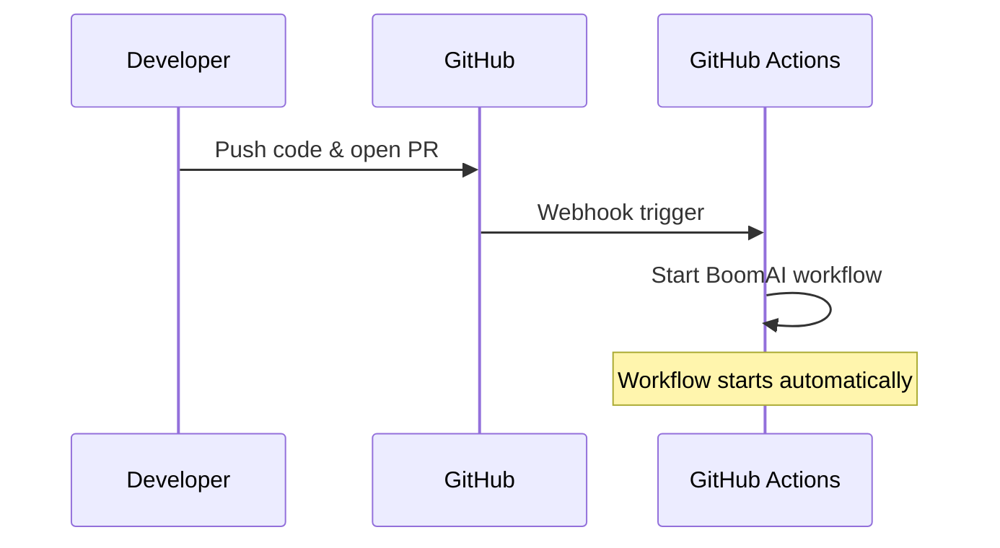
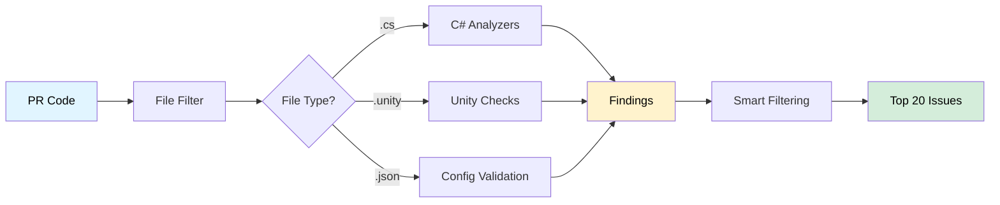
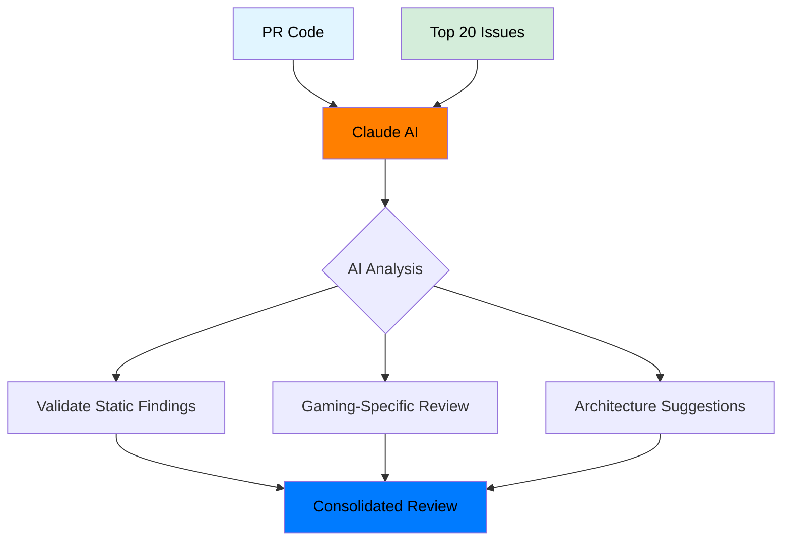
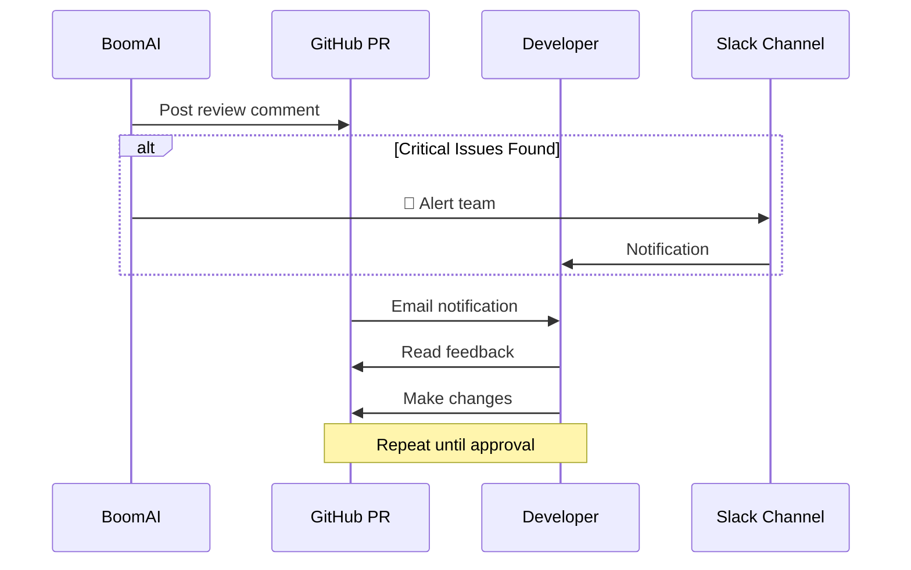
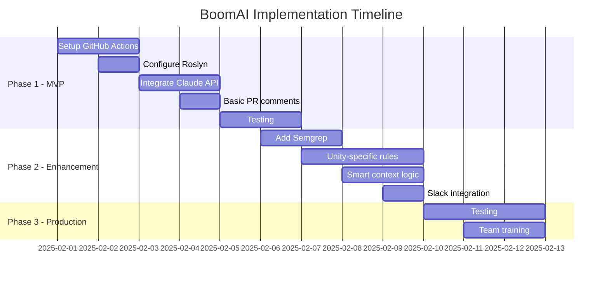

# BoomAI - AI-Powered Code Review System
## Requirements Document for Boom Corp.

---

## 📋 Executive Summary

**BoomAI** is an automated code review system that will be integrated into Boom Corp's GitHub workflow. Every time a developer opens a Pull Request, the system:

1. ✅ Automatically checks the code with static analysis tools
2. 🤖 Uses AI (Claude) for intelligent review
3. 💬 Leaves comments with improvement suggestions
4. 📊 Records metrics to track progress

**Goal:** Catch bugs, performance issues, and security problems earlier - before they reach production.

**Estimated Cost:** ~$10-20/month for typical usage

---

## 🎯 What Problem It Solves

### Current Situation:
- ❌ Code reviews are done manually or not at all per Miikka, if it works, it works😂
- ❌ Some bugs slip through (especially performance issues)
- ❌ Junior developers don't know Unity best practices
- ❌ No consistency in code reviews

### With BoomAI:
- ✅ Instant feedback on every PR
- ✅ Automatic detection of performance bottlenecks
- ✅ Learning tool for the team (they see what needs to change)
- ✅ Consistent standards across the entire codebase

---

## 🏗️ System Architecture



---

## 🔄 Workflow - How It Works

### Step 1: Trigger


**What happens:**
- Someone creates a PR
- GitHub automatically notifies the system
- Automated review begins

---

### Step 2: Static Code Analysis



**What happens:**
- Reads which files changed
- Runs appropriate analysis tools
- Keeps only important findings (no spam)

---

### Step 3: AI Review



**What happens:**
- AI receives the changed files and top 20 findings
- Checks if static tools are correct (false positives)
- Adds gaming-specific feedback (performance, memory, Unity patterns)
- Provides refactoring suggestions

---

### Step 4: Feedback



**What happens:**
- AI leaves a comment on the PR
- If there are critical issues → alert to Slack
- Developer sees feedback and makes fixes
- Repeat until OK

---

## 💡 Developer Experience - Applying Fixes

BoomAI provides **4 ways** to apply fixes:

### 1. Quick Apply (All Fixes)
```
Comment: /boomAI apply-all
Result: All fixes committed in one go
```

### 2. File-Specific Apply
```
Comment: /boomAI apply-file PlayerController.cs
Result: All 3 fixes in that file committed together
```

### 3. Individual Apply
```
Click the green [Commit suggestion] button
Result: Single fix committed
```

### 4. Batch Apply (Selected Fixes)
```
1. Check boxes next to desired fixes
2. Comment: /boomAI apply-batch
Result: Only checked fixes committed
```

**Example Workflow:**
1. Review fixes
2. `/boomAI apply-all`
3. Or cherry-pick → Check Fix #1, #4, #7 → `/boomAI apply-batch`
    
---

## 🎮 Gaming-Specific Features

### Unity Performance Checks

**What it will detect:**

```csharp
// ❌ BAD - BoomAI will catch this
void Update() {
    GameObject player = GameObject.Find("Player");  // Every frame!
    player.transform.position = newPos;
}

// ✅ GOOD - BoomAI suggestion
private GameObject player;
void Awake() {
    player = GameObject.Find("Player");  // Once
}
void Update() {
    player.transform.position = newPos;
}
```

### Memory Leak Detection

```csharp
// ❌ BAD - Garbage allocation in loop
void SpawnBullets() {
    for (int i = 0; i < 100; i++) {
        Instantiate(bulletPrefab);  // Creates garbage
    }
}

// ✅ GOOD - BoomAI suggestion: Use object pooling
void SpawnBullets() {
    for (int i = 0; i < 100; i++) {
        bulletPool.Get();  // Reuse objects
    }
}
```

### Threading Issues

```csharp
// ❌ BAD - Unity API call from thread
Task.Run(() => {
    transform.position = newPos;  // CRASH!
});

// ✅ GOOD - BoomAI will detect this
```

---


## 🛠️ Technical Components

### 1. Static Analysis Tools

| Tool | What It Does | Why We Need It |
|------|----------|------------------------|
| **Roslyn Analyzers** | Checks C# code quality | Built-in for C#, finds basic bugs |
| **Semgrep** | Security & custom patterns | Detects vulnerabilities + Unity anti-patterns |
| **Unity Analyzer** | Unity-specific checks | MonoBehaviour lifecycle, performance traps |

**Output:** JSON with findings (severity, location, description)

---

### 2. AI Engine (Claude Sonnet 4)

**Why Claude?**
- ✅ Excellent at code understanding
- ✅ 200K context window (large PRs OK)
- ✅ Affordable pricing 

**What It Does:**
1. Validates static analysis findings
2. Gaming-specific review
3. Architecture suggestions
4. Explains WHY something is a problem

---

### 3. GitHub Integration

**How It Connects:**
- GitHub Actions workflow (`.github/workflows/boomAI.yml`)
- Runs automatically on every PR
- Posts comments via GitHub API

---

## 🚀 Implementation Phases

**\* Note: Dates below are placeholders for visualization only - ignore actual dates**



---